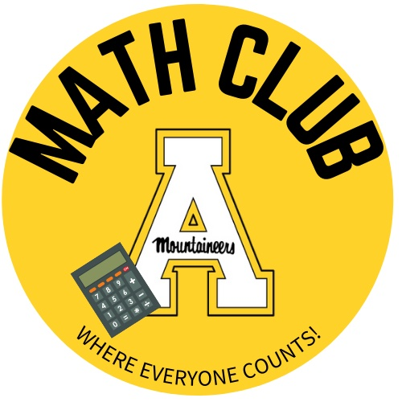

<h3 align="center" >
Caroline Fehlman
</h3>

<h4 align="center" >
Undergraduate Student Researcher   Appalachian State Univeristy

E-mail: fehlmanca@appstate.edu

[Linkedin](www.linkedin.com/in/carolinefehlman)

</h4>

Academic & Career Goals
---
- Attend graduate school to recieve a Master in College Math and Geography.
- Attend graduate school to recieve a PhD.
- Conduct research and publish scientific papers in the realm of Public Health and Environmental Science.

Experience
---
##### Undergraduate Student Researcher, *2020-Present*
*Research Institute for Environment, Energy, and Economics, Appalachian State University*
- Conducting research involving climate, carbon emissions, population, GDP, and resiliency variables with tasks consisting of literature reviews, data analysis, and spatial analysis.

##### Chair of Student Advisory Board, *2021-Present*
*Department of Mathematical Sciences, Appalachian State University*
- Collaborating with board members to create a link of communication between faculty and students and implement projects such to improve the experience within the department.

##### Vice President of App State Math Club, *March 2022-Present*
*Department of Mathematical Sciences, Appalachian State University*
- Contribute to how the club is managed, attend meetings, implement activities and projects, and assist the president of the club.

##### Research Experience for Undergraduates (REU), *2021*
*North Carolina State University, Appalchian State Univeristy*
- Recieved an introduction to Python computer language and atmospheric science.
- Conducted a project involving climate change research.

Awards & Honors
---
##### GlaxoSmithKline Women in Science Endowment, *2021-2022*
*College of Arts and Sciences, Appalachian State University*

##### Undergraduate Research Assistantship (URA) Program Award, *2021-2022*

Education
---
##### Mathematics Major, Appalachian State University, *2019-Present*

- Pursing a Bachelor of Science in Mathematics, expected graduation date: May 2023
- Departmental Honors Program

##### Pursuing GIS Certificate, Appalachian State Univeristy

<h4 align="center">

</h4>
